# Machine learning-enabled Self-Consistent Field Theory

Polymers are chain-like molecules which arrange themselves in ways that provide special properties and behaviors observed in materials, and Self-Consistant Field Theory (SCFT) is a mathematical framework which makes it possible to study these complex polymer systems. SCFT helps us understand how these polymers arrange themselves, and under what conditions different polymer phases will appear. Overall, SCFT is the traditional and main method used to simulate polymers when studying their equilibrium structures and phase behavior.

Our research group's overall goal is to use machine learning to make simulations of polymers faster and more efficient. Our research faces two kinds of problems, the forward problem and the inverse design problem. The forward problem involves training machine learning models to predict the stable morphology of a polymer system based on given formulation parameters, and the inverse design problem involves training machine learning models to predict what formulation parameters stabilize a given morphology. By building models that solve these problems, we can drastically reduce the cost and time required to run traditional SCFT simulations.

In my research I am investigating the polymer system called the miktoarm system, and my primary objective is to build a machine learning model to predict optimal cell length—an important initial value for running computer simulations for polymers of the miktoarm system—based on a set of formulation parameters that determine the polymer phase. We hypothesize that accurately predicting the cell length will enhance simulation convergence rates.

Our goal is to utilize this model to accelerate computer simulations of polymers for the miktoarm system to build a comprehensive database that we can employ in solving forward and inverse design problems.

## Initial Concerns about the Data before Modeling Cell Length

Computer simulations of polymers are based on a set of formulation parameters, initial density fields, and initial cell length. The formulation parameters of the miktoarm system are `chiN`, `fA`, and `tau`. Cell length is the value we are trying to predict, and density fields are chosen from previous simulations that converged properly. For our simulations, `chiN`, `fA`, and `tau` are chosen uniformly.

**Distributions of `chiN`, `fA`, and `tau`:**

  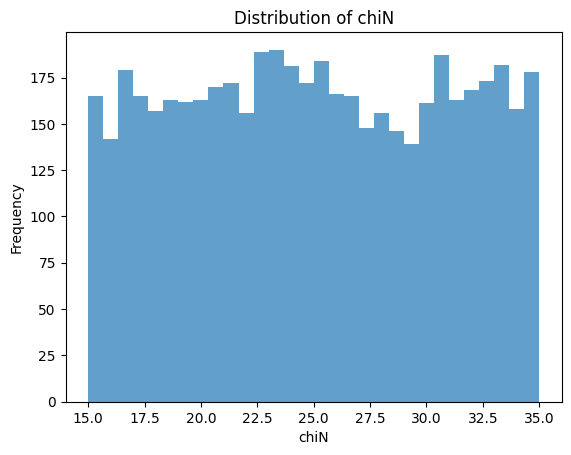
  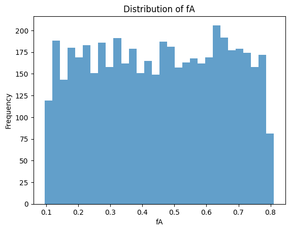
  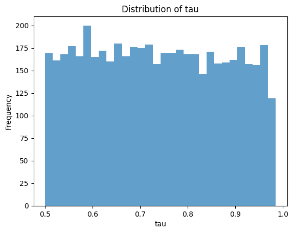

 

The miktoarm system can structure itself into multiple ordered phases depending on the values of `chiN`, `fA`, and `tau`. For the purpose of demonstrating my research, I will focus on the two-dimensional HEX phase. The density of the HEX phase looks as follows.

  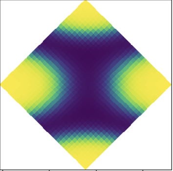

 

Our first sign of concern is seen in the values of cell length in the 3D-space of `chiN`, `fA`, and `tau`. Note that `L` represents cell length in the images below. Given that cell length is expected to be a continuous function of `chiN`, `fA`, and `tau`, the sudden spikes of `L` near 0.5, 0.6, and 0.7 on the axis of `fA` are alarming. In addition, there are regions in the 3D-space where the transitioning of `L` does not seem smooth. 

**Highlighting Cell Length in the Space of `chiN`, `fA`, and `tau`:**

  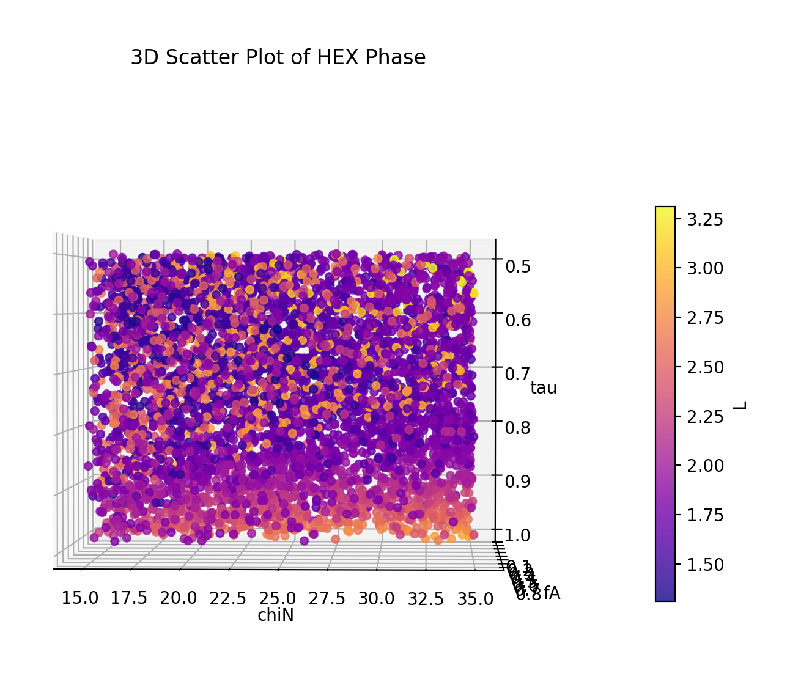
  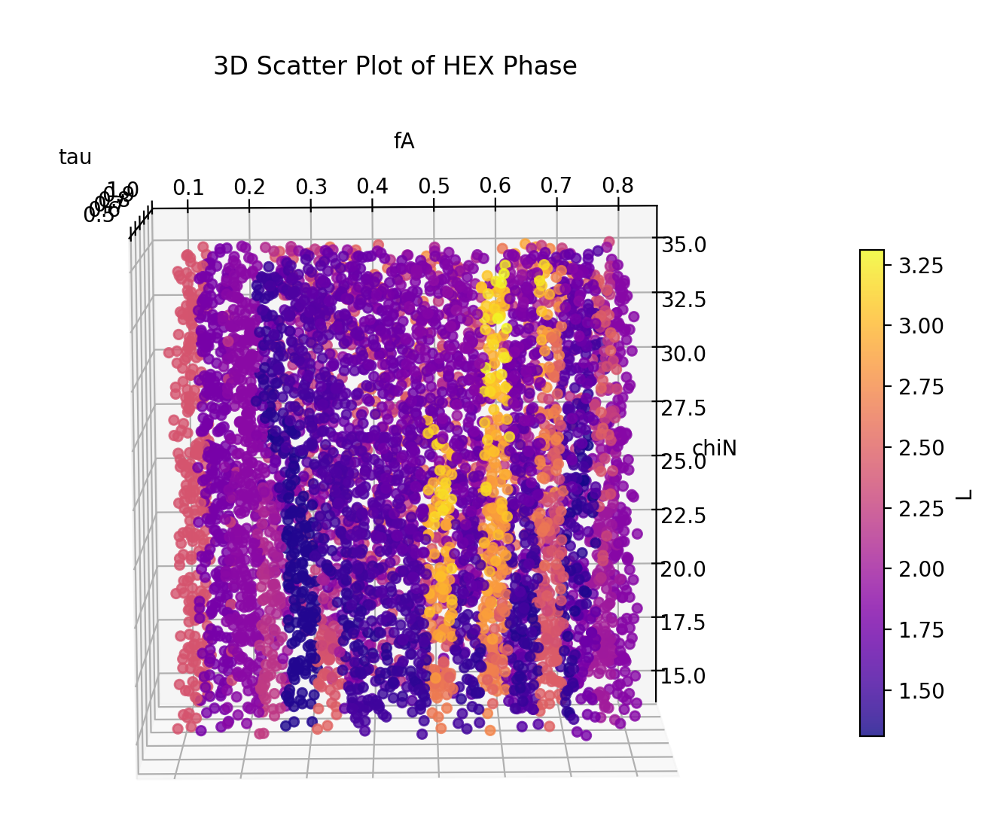
  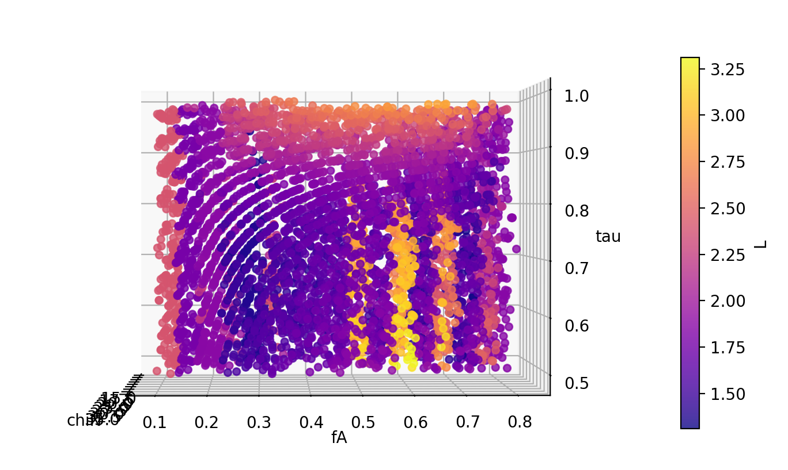

 

After observing this 3D plot and visualizing the densities for our simulations, we realized that the densities from simulations that did not converge properly were negatively impacting the smoothness of `L` across `chiN`, `fA`, and `tau`. We identified five potential classes for our densities: correct (converged properly), bleeding, disordered, hollow, and double period.

  

    
Correct

    
  

  

    
Bleeding

    
  

  

    
Disordered

    
  

  

    
Hollow

    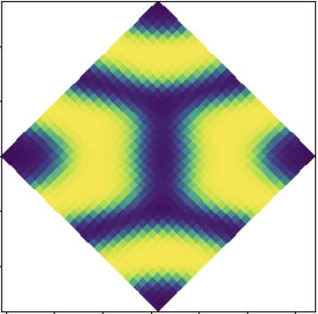
  

  

    
Double

    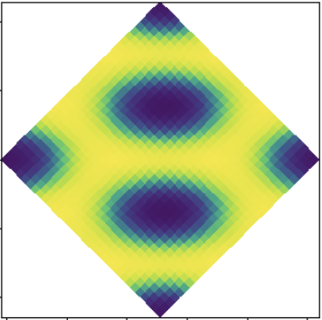
  

 

We need to rerun the simulations for densities that did not converge properly to correct our values of `L`. Given that each simulation for the HEX phase takes roughly 2–3 minutes—and much longer for the other phases—it would be impractical to redo every simulation across all formulation parameters. Instead, I implemented a clustering algorithm to group together the formulations based on if they achieved the correct density, allowing us to selectively rerun the problematic simulations without having to touch the ones that converged properly.

The code used to cluster the densities is seen in the `cluster_densities.py` file.

### HEX Clustering Implementation Details (for nerds):

1. For each density.dat file (of each formulation), extract the 3rd column.

2. Reshape the column into a 32x32 matrix.

3. Compute the FFT of the matrix and divide it by its L2 norm.

4. Select and separate representative formulations (`chiN`, `fA`, & `tau`) for each possible density from the dataset.

5. Compute the dot product of each normalized FFT image with the normalized FFT representatives. This provides a 5-dimensional vector.

6. Apply k-means clustering to the set 5-dimentional vectors.

I clustered the data into 5 categories.

- **Cluster 0**: contains densities that are double period or hollow.

- **Cluster 1 & 2**: contains densities that are correct.

- **Cluster 3**: contains ambiguous densities that are either correct or bleeding.

- **Cluster 4**: contains disordered densities.

  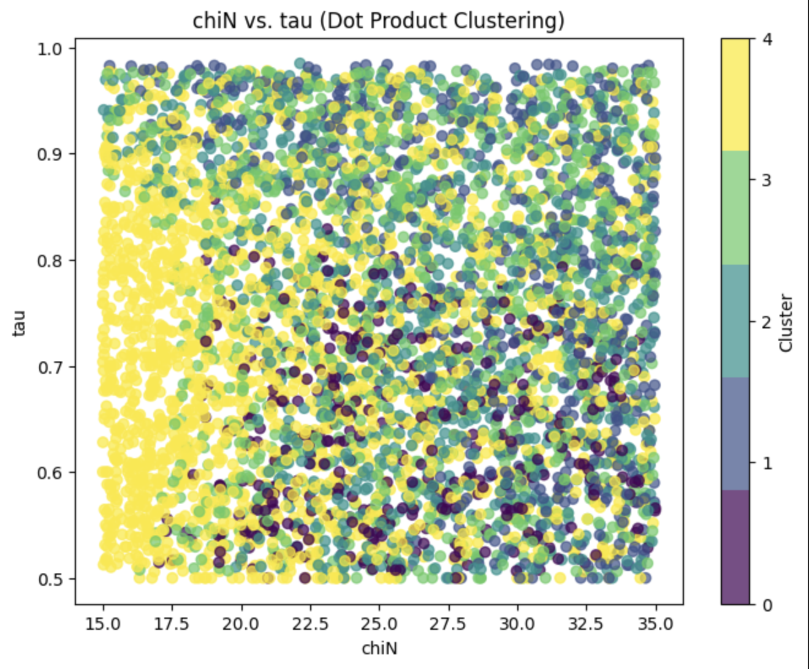
  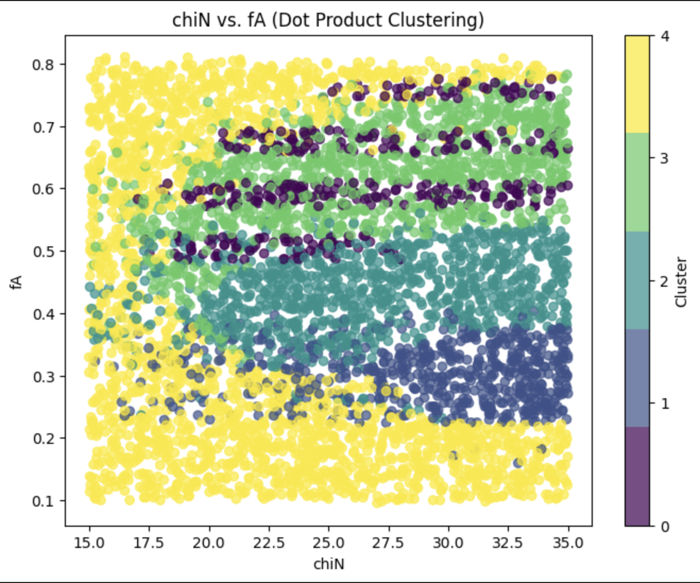
  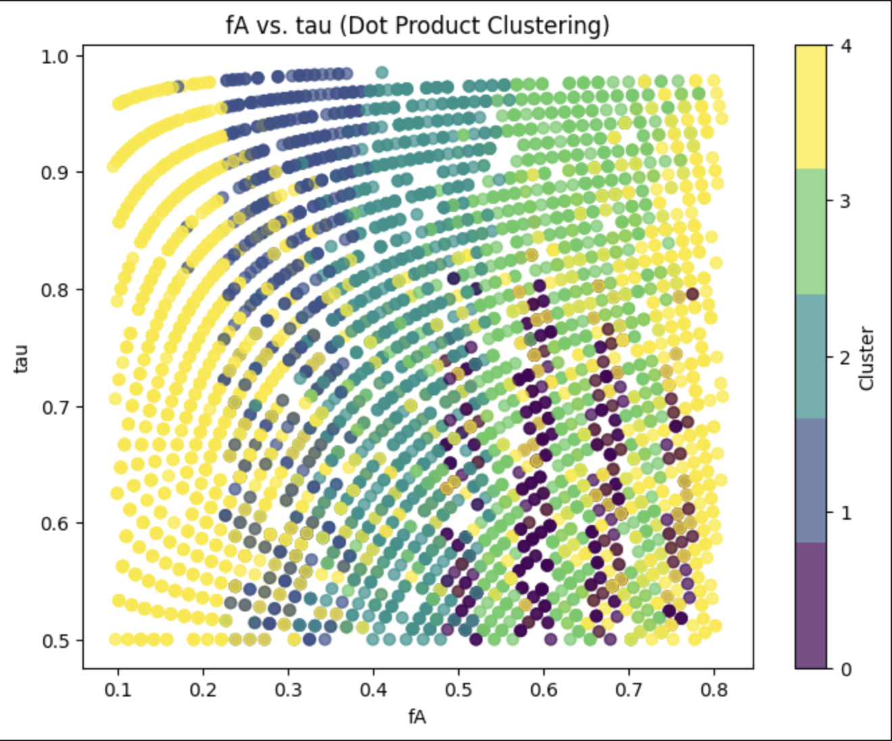

 

Since we do not have a model to predict cell length yet, the best approach to estimate cell length for our simulations is to use the `L` value from the nearest formulation in the 3D space of `chiN`, `fA`, and `tau` that converged properly. In the `nearest_L_bad_sims.py` script, I implemented code to find the nearest neighbor of each 'bad' formulation (i.e., one that did not converge properly) in the set of 'good' formulations (i.e., those that did converge properly) by computing the L2 norm of each formulation in the 'bad' set with every formulation in the 'good' set, and returning the 'good' formulation that minimizes this norm.

### Nearest Neighbor Search Implementation Details (for nerds):

1. Extract and MinMax scale the `chiN`, `fA`, and `tau` values from both 'good' and 'bad' formulations.

2. Convert the scaled values to 3D coordinate arrays.

3. For each 'bad' point, compute its Euclidean distance to all 'good' points.

4. Identify the 'good' formulation with the minimum distance and retrieve its unique key.

5. Map the corresponding `L` value from the 'good' formulations to the 'bad' point using the key.

### Overall Process to ensure Good Quality of Cell Lengths:

1. Run `cluster_densities.py` to generate the clusters.

2. Manually inspect the clusters to identify which ones contain densities that did not converge properly.

3. Run `nearest_L_bad_sims.py` with the list of identified 'good' and 'bad' formulations to assign each 'bad' formulation the `L` value from its nearest 'good' neighbor.

4. Compile a file that contains the 'bad' formulations along with their corresponding estimated `L` values.

5.Run `create_test_dirs.py` to create the directories needed to run simulations for each formulation.

6. Run `re_simulate_batch.sh` to simulate each formulation.

## Current Work

After correcting all the values of `L` by re-simulating all the `bad` formulations, I created a baseline gradient boosted trees model to evaluate the performance of using predicted cell lengths in the computer simulations. I plan to test the simulations' convergence rates with the predicted values of `L` for formulations in the test set.

### Implementation Details for Predicting Cell Length (for nerds):

1. Load the main data file containing the formulations and their corresponding cell lengths.

2. Load a separate list of formulations to include in the process of building the model and predicting `L` for the experiment (this list should contain all formulations after rerunning the ones that previously converged poorly). Filter the main data file by these formulations.

3. Preprocess the data by separating the predictors, `chiN`, `fA`, and `tau`, and the target variable, `L`.

4. MinMax scale the features between 0 and 1.

5. Split the data between training and testing sets.

6. Use the XGBoost package to train a Gradient Boosted Trees algorithm on the training set.

7. Use the model to create predictions on the test set.

8. Unscale the features in the test set to their original scales for `chiN`, `fA`, and `tau`. Save these with the predicted values of `L` and uniformly sample the number of formulations to be used in the experiment. We limit this number because the simulations may take a long time even if the cell length converges faster.

I will compare the performance of initially setting the cell length using predicted values against that obtained by using the cell length from the formulation's nearest converged neighbor. The implementation details for finding the cell length of the formulation's nearest neighbor are similar to those used in the previous nearest neighbor search.

After obtaining datasets containing formulations and their corresponding predicted and nearest neighbor `L`, I will run simulations for each formulation for both values. During these simulations, I will collect performance metrics for each step—particularly total runtime and the number of iterations required for the simulations to converge. I will directly compare these metrics to determine the effectiveness of predicting cell length for running computer simulations of polymers.

### Current Work Flow

1. Run `predicted_L.py` to collect a dataset of formulations and their corresponding predicted `L` values.

2. Run `nearest_L_exp.py` to collect a dataset of formulations and their corresponding `L` from their nearest converged neighbor.

3. Run `create_test_dirs.py` to build the directories required for running simulations for each formulation.

4. Run `run_experiments.sh` to run the simulations within each batch created from the previous step using the `experiment.sh` shell script. This shell script will collect the metrics needed to analyze the effectiveness of predicting cell length for running computer simulations.

## Next Steps

In conclusion, after running my experiments to determine the effectiveness of predicting cell length in improving convergence rates of computer simulations for the HEX phase, I want to adapt the code to test my hypothesis for the other phases of the miktoarm system. In addition, I will refine the code to find which formulations had densities that did not converge properly, and rerun those problematic simulations. After re-simulating the 'bad' formulations for each phase, my ultimate goal is to fine-tune a model that universally and accurately predicts cell length for every phase. We will leverage this model to develop a comprehensive database for the miktoarm system, which will be instrumental in solving both forward and inverse design problems.
